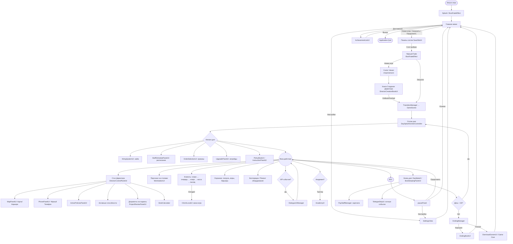

# Bureau Crazy — User Flow всех экранов и систем

Документ описывает полный сценарий игрока от запуска до одной из реализованных концовок, последовательное открытие экранов и таблицу соответствия экран↔UI-класс↔менеджер. Основан на исходном коде (`Assets/Scripts/UI/*`, `Assets/Scripts/Managers/*`) и проектной документации (`.Docs.New/01-…08-*.md`, `PROJECT_STATUS.md`).

---

## 1. Сценарий игрока (нарратив)

### 1.1. Запуск приложения
Приложение стартует → `BootFadeEffect` затемняет экран → стартовый сплеш «Bureau Crazy» → автоматический переход в **Главное меню**.

### 1.2. Главное меню
`MainMenuController` / `MainMenuActions` показывают панель с кнопками:
- **Новая игра** (или **Загрузить игру**, если есть сохранение — текст меняется динамически).
- **Продолжить** — только при наличии свежего сейва.
- **Достижения** → `AchievementListUI`.
- **Настройки** → `SettingsView`.
- **Выход** → `Application.Quit()`.

### 1.3. Ветка «Новая игра»
1. `Action_OpenSaveLoadPanel()` → панель слотов `SaveSlotUI`.
2. Игрок выбирает слот 1…N.
3. `Action_StartNewGameWithDirectorCreation(slotIndex)` запускает корутину `NewGameDirectorCreationFlow()`:
   - гасится музыка (`MusicPlayer.StopMusic`);
   - прячется Маскот (`TutorialMascot.SetActive(false)`);
   - запускается `BootFadeEffect.PlayCloseRoutine()` (чёрный fade).
4. После затемнения открывается панель **Книги Создания Директора** (`DirectorCreationBookUI.OpenBook()`).
5. Книга листается по страницам `BookPageData` из `BookPageDatabase.Instance`; на каждой странице 2–3 выбора, формирующие `DirectorInitialState` и `creationCode`.
6. На финальной странице игрок жмёт «Начать игру» → событие `OnBookFinished(initialState, code)`.
7. `MainMenuActions.OnDirectorCreationFinished` вызывает `MainUIManager.StartNewGameWithDirectorCreation(slot, state, code)` → `TransitionManager` грузит `GameScene` с переданным состоянием.

### 1.4. Ветка «Загрузить»
1. `Action_OpenSaveLoadPanel()` → `SaveSlotUI`.
2. Клик по слоту → `MainUIManager.OnSaveSlotClicked(slot)` → `SaveLoadManager.Load(slot)` → `TransitionManager` → `GameScene` с заполненным состоянием (деньги, персонал, апгрейды, Influence, день/период).

### 1.5. Вход в игровой день
При загрузке `GameScene`:
1. `DaySplashScreenController` показывает короткую заставку «День N».
2. Загружается HUD: `GameClockUI` / `IconClockUI`, `DayCounterUI`, `PlayerWallet`, `InfluenceUI`, `BureauReputationUI`, `NotificationUI` + `FloatingText`.
3. `CalendarManager` + `TimeManager` стартуют первый период дня из `SingleDayTimeSystem`.

### 1.6. Подготовительная фаза (начало дня)
Игрок последовательно открывает панели (порядок гибкий):
- **Найм** — `HiringSystemUI` + `HiringPanelUI` + `ResumePin` (резюме на доске). `HiringManager` генерирует кандидатов через `ResumeGenerator`; клик «Нанять» списывает стоимость найма и добавляет сотрудника.
- **Расписание** — `StaffSchedulePanelUI` + `StaffScheduleRowUI` + `ScheduleCellUI`. Игрок распределяет сотрудников по периодам и точкам обслуживания.
- **Приказы** — `OrderSelectionUI` + `OrderCardUI`. Игрок выбирает 1 из 3 утренних приказов (`OrderManager`).
- **Апгрейды** — `UpgradePanelUI` + `UpgradeIconUI` + `UpgradePopupUI`. Покупка мебели/оборудования за деньги или за `UpgradeManager` (через документы).
- **Политики / Должностная инструкция** — `PolicyBookUI` (общие правила), `ActivePoliciesPanelUI` (текущие), `InstructionPanelUI` + `InstructionItemUI` (приоритеты/приветствия/деньги). Запускается через `PolicyDeskButton` на столе.

### 1.7. Фаза действия (основной геймплей)
Камера RTS-style (WASD + мышь, `CameraToggle` для фикса вида сверху). Игрок управляет аватаром-Директором через `StaffController`.

**Стол Директора** (`DirectorDeskAccessController`, `ShowDirectorDeskButton`, `DirectorControlPanelUI`):
- Кнопка **Карты Города** (`MapPanelUI` — мета-игра).
- **Чёрный телефон** (`DeskPhoneController` + `PhonePanelUI` + `PhoneManager`): экстренные службы (СПЕЦНАЗ, спец-клининг, Клоун, агентство «Затячка»).
- Список **Активных приказов** (из `ActivePoliciesPanelUI`).
- Список **Активных способностей** (открываются по рангу: «Ускорение», «Выгнать клиента», «Принудительный овертайм», «Взятка ревизору»).
- **Документы на подпись** (`DirectorDocumentIcon` + `ProjectReviewPanelUI` + `ProjectDocumentIconUI`): мини-игра «найди опечатку» в сгенерированном бюрократическом тексте.
- `DeskCalculator` — взаимодействие.

**Столы сотрудников** — `WorkstationUI` показывает загрузку, стопки документов, прогресс-бар `ProcessingProgressBar`.

**Клиенты** спавнятся по `ClientSpawnerWithArchetypes` (с расписанием `SingleDayTimeSystem`):
- Жизненный цикл: спавн → вход → Регистратура (`ServiceAtRegistrationExecutor`) → очередь (`ClientQueueManager`) → Клерк (`ClerkController`/`InternController`) → Касса (`Cashier`) → выход.
- При долгом ожидании нарастает `HeatLevel`: Calm → Grumbling → Frustrated → Enraged. При Enraged над головой клиента/сотрудника — таймер «Клинча» (`ClinchTarget`); клик по человечку открывает `ClinchLocalUI` (замок + 3 ключа, перемешанные Фишером-Йейтсом; верный ключ — успех).
- Архетипы: Бабушка, Мажор (VIP), Скандалист, Бездомный, Студент, Работник и др. — характеристики задаются в `ArchetypeDatabase` через `ClientArchetype`.

**Охранник** (`GuardManager`, `GuardMovement`):
- Патрулирование `patrolPoints`.
- Задержание воров (`CatchThief` action).
- Успокоение буянов.
- Открытие/закрытие `SecurityBarrier`.

**Беспорядок и оборудование:**
- `MessPoint` / `Puddle` / `TrashCan` создают зоны; влияют на скорость и комфорт.
- `OfficeEquipment` (компьютер, кофемашина, ксерокс) изнашивается (`OfficeObjectDurability`); виден `DurabilityStatusUI`.
- Ремонт: микро (`CleanMess` через Уборщика) или макро через документ «Ремонтная бригада».

**Сюжетные события:**
- Спец-посетитель (`SpecialVisitorDatabase`) → запуск `DialogueUIManager` через `DialogueUIConnector`: граф `DialogueGraph` с узлами `StartNode` → `PhraseNode` / `ChoiceNode` / `ConditionNode` / `RandomNode` / `EventNode` → `EndNode`. Показ `nodeImage` (портрет) и `defaultBackground`. Выборы дают последствия (взятка/отказ, нарушение закона).
- Ревизии / Проверки — случайные по сценарию дня.

### 1.8. Концовка дня
Каждый вечер:
1. `TimeManager` останавливает текущий период.
2. `DaySplashScreenController` показывает экран итогов (штрафы/премии).
3. `BookkeepingPanelUI` + `BookkeepingLog` детализируют «Подочётный / Теневой / Расходы / Итог» через `FinancialLedgerManager`.
4. `PayStaffManager` списывает зарплату.
5. Возможные ночные события → `TeletypeStripUI` (`TeletypeManager`, форматтеры `TeletypeMessageFormatter`, ресайзер `MessageStripResizer`).
6. Если день < 30 → переход к следующему дню. Иначе → `EndingManager`.

### 1.9. Мета-слой (Карта и Карьера)
Клик по кнопке «Карта» на столе Директора → `MapPanelUI`:
- Визуальная карта с `RegionSlotUI` (районы: Трущобы → Центр → Промзона → Правительственный).
- Дерево карьеры `JobNodeUI` (Директор → Региональный менеджер → Глава департамента → Зам. Министра → Министр).
- Инфо-панели `regionInfoPanel` / `jobInfoPanel` показывают стоимость, требования, бонусы.
- Кнопки действий: **Захват** / **Защита** / **Продвижение** (расходуют Influence).
- Захват района → новые архетипы клиентов и источники пассивного дохода.
- Повышение ранга → новые активные способности Директора.

### 1.10. Академия Директората
`AcademyScenarioManager` запускает `AcademyUI` по триггерам (`GameDayTrigger`: StartOfGame / NewMechanic / SpecialEvent). Типы шагов: `Dialogue`, `Choice`, `TimerChallenge`, `Explanation`, `Minigame`, `KobayashiMaru` (невозможный тест, награда за креативный путь решения).

### 1.11. Системные слои

- **Сохранения** — `SaveLoadManager` (JSON). Слоты, авто-сейв, сериализация денег / персонала / прогресса / Influence / дня.
- **Пауза (ESC)** — `pausePanel` (ищется по имени «pausepanel» в DontDestroyOnLoad): Продолжить / Настройки / Выход в Меню (с автосохранением).
- **Достижения** — `AchievementManager`; разблокировка показывает `AchievementToastUI`, доступ к списку — `AchievementListUI` + `AchievementItemUI`.
- **Уведомления** — `NotificationManager` рассылает события (OnAchievementUnlocked, OnUpgradePurchased, штрафы), всплывают `NotificationUI` + `FloatingText`.

### 1.12. Концовка (день 30)
`EndingManager` выбирает концовку по состоянию игры. Реализованные экраны:
- **`EndingBookUI`** — «хорошие» концовки (например, «Министр»): закрытая книга с обложкой и страницами итогов.
- **`DismissalScreenUI`** — «плохая» концовка (увольнение / арест / банкротство).

После концовки `EndingManager` возвращает игрока в **Главное меню**, где можно начать новую партию с новой книгой Директора.

---

## 2. Полная таблица экранов и систем

| № | Экран / Состояние | UI-класс(ы) | Менеджер(ы) | Триггер открытия | Что внутри / Действия | Закрытие / Возврат |
|---|---|---|---|---|---|---|
| 0 | Splash / Boot | `BootFadeEffect` | `SystemBootstapper` | Запуск приложения | Чёрный fade-in с логотипом | Авто → MainMenu |
| 1 | Главное меню | `MainMenuController`, `MainMenuActions`, `MainMenuDialogueTrigger` | `SaveLoadManager`, `MusicPlayer`, `TutorialMascot` | Старт / Из паузы / Из концовки | Кнопки: Новая игра / Загрузить / Продолжить / Достижения / Настройки / Выход | Клик по кнопке → 2/3/26/25/Quit |
| 2 | Панель слотов сохранений | `SaveSlotUI` | `SaveLoadManager` | `MainMenuActions.Action_OpenSaveLoadPanel()` | Список слотов (есть/нет, дата, превью), кнопки «Загрузить» / «Удалить» / «Новая игра» | Кнопка «Назад» → MainMenu (1) |
| 3 | Книга Создания Директора | `DirectorCreationBookUI` | `BookPageDatabase`, `DirectorInitialState` | После выбора слота в ветке «Новая игра» | Страницы с иллюстрациями, 2–3 выбора на страницу, `resultImage`, `finalBackgroundImage`, кнопка «Начать игру» на последней странице | Событие `OnBookFinished` → Transition → GameScene |
| 4 | Comic Viewer (опц. вступление) | `ComicViewerUI` | — | Перед книгой директора (опционально) | Страницы комикса с анимацией перелистывания, кнопки Вперёд/Назад/Закрыть, счётчик | Кнопка «Закрыть» → Книга (3) или MainMenu (1) |
| 5 | HUD игрового дня | `GameClockUI`, `IconClockUI`, `DayCounterUI`, `InfluenceUI`, `BureauReputationUI`, `ResourceStatusUI`, `NotificationUI`, `FloatingText` | `TimeManager`, `CalendarManager`, `PlayerWallet`, `ProgressionManager`, `NotificationManager` | Всегда в `GameScene` | Баланс $, Influence, день/период, потребности, очередь сообщений, всплывающие подсказки | Не закрывается (часть мира) |
| 6 | Сплэш дня | `DaySplashScreenController` | `CalendarManager`, `TimeManager` | Старт каждого дня, концовка дня | «День N», мини-итоги | Авто (через N сек) → GameScene |
| 7 | Панель найма | `HiringSystemUI`, `HiringPanelUI`, `ResumePin` | `HiringManager`, `ResumeGenerator`, `RoleColorDatabase` | Начало дня / по сюжету | Резюме на доске (имя, навыки, роль, цветовая метка), кнопки «Нанять» / «Закрыть» | Кнопка «Закрыть» → возврат в мир |
| 8 | Панель расписания | `StaffSchedulePanelUI`, `StaffScheduleRowUI`, `ScheduleCellUI` | `AssignmentManager`, `StaffScheduleExtensions`, `StaffPunctualityConfig` | Начало дня | Сетка период × сотрудник × точка обслуживания | Кнопка «Закрыть» → возврат в мир |
| 9 | Панель приказов | `OrderSelectionUI`, `OrderCardUI`, `OrderManager` (логика) | `OrderManager`, `CalendarManager` | Утро (выбор 1 из 3) | Карточки приказов (мандаты / баффы / экономические / события), описание, эффекты | Клик по карточке → приказ активен → возврат |
| 10 | Панель апгрейдов | `UpgradePanelUI`, `UpgradeIconUI`, `UpgradePopupUI` | `UpgradeManager` | Начало дня | Список апгрейдов (функциональные: кофемашина/кресла/автомат; визуальные: ковры/картины/цветы) | Клик по апгрейду → покупка/документ на подпись |
| 11 | Политики / Инструкции | `PolicyBookUI`, `ActivePoliciesPanelUI`, `InstructionPanelUI`, `InstructionItemUI`, `PolicyDeskButton` | `PolicyManager`, `InstructionManager`, `JobInstructionDatabase` | Начало дня / клик по столу | Книга правил, активные приказы, должностные инструкции (приоритеты, приветствия, деньги) | Кнопка «Закрыть» → возврат |
| 12 | Окно стола Директора | `DirectorDeskAccessController`, `DirectorControlPanelUI`, `ShowDirectorDeskButton` | `DirectorManager` | Клик по столу Директора в фазе действия | Кнопки: Карта / Телефон / Активные приказы / Способности / Документы на подпись / Калькулятор | Клик вне стола → закрытие |
| 13 | Чёрный Телефон | `PhonePanelUI`, `DeskPhoneController` | `PhoneManager` | Кнопка «Телефон» в столе Директора | Список услуг (СПЕЦНАЗ, Спец-клининг, Клоун, агентство «Затячка») с ценой и КД | Кнопка «Закрыть» → возврат к столу |
| 14 | Документы на подпись | `DirectorDocumentIcon`, `ProjectReviewPanelUI`, `ProjectDocumentIconUI`, `GlobalDocumentUI` | `DocumentManager`, `DocumentQualityManager`, `BureaucracyManager` | Клик по стопке документов на столе | Текст «бюрократического» документа, мини-игра «найди опечатку», кнопки «Подписать» / «Взятка» / «Отклонить» | Подпись / Отмена → возврат |
| 15 | Карта Города / Карьера | `MapPanelUI`, `RegionSlotUI`, `JobNodeUI` | `ProgressionManager`, `PlayerWallet`, `DocumentManager` | Кнопка «Карта» на столе | Визуальная карта с `RegionSlotUI`, дерево `JobNodeUI`, инфо-панели региона/должности, Influence-баланс, кнопки Захват / Защита / Продвижение | Кнопка «Закрыть» → возврат к столу |
| 16 | Академия Директората | `AcademyUI` | `AcademyScenarioManager` | Триггер `StartOfGame` / `NewMechanic` / `SpecialEvent` | Сценарии с шагами Dialogue / Choice / TimerChallenge / Explanation / Minigame / KobayashiMaru | Завершение → возврат в мир |
| 17 | Диалог (VIP / событие) | `DialogueUIManager`, `DialogueUIConnector`, `ComicViewerUI`-графика | `DialogueGraph`, `SpeakerProfile`, `SpecialVisitorDatabase` | Приход VIP-события, ревизии | Портрет говорящего, фон, реплики, варианты выбора с последствиями | Достижение `EndNode` → возврат |
| 18 | Клинч-мини-игра | `ClinchTarget`, `ClinchLocalUI` | `AIBalanceConfig` (`clinchTimeoutDuration`) | Клиент/сотрудник в HeatLevel.Enraged | Замок с цветовой подсказкой + 3 перемешанных ключа + таймер | Выбор ключа / Таймаут → возврат |
| 19 | Tooltips | `TooltipManager`, `TooltipTarget` | — | Наведение курсора на объекты/кнопки | Короткое описание объекта/действия | Уход курсора |
| 20 | Workstation / стол сотрудника | `WorkstationUI`, `ProcessingProgressBar`, `ProcessingAnimationUI` | `AssignmentManager`, `DocumentManager` | Всегда в фазе действия | Состояние стола, прогресс обработки, стопка документов, индикация | Не закрывается (часть мира) |
| 21 | World-объекты (метки) | `WorldSpaceStatusIcon`, `DurabilityStatusUI`, `WorldNoticeBoard`, `SmartRoomLabel` | `DurabilityManager`, `EquipmentManager` | Всегда в фазе действия | Прочность мебели, статус объектов, метки комнат (наведение) | Не закрывается |
| 22 | Карточка персонала | `TeamMemberCardUI`, `StaffNameLabelUI` | `StaffController`, `TraitManager`, `RoleColorDatabase` | Клик по сотруднику | Имя, роль, навыки (paperworkMastery / sedentaryResilience / pedantry / softSkills / corruption), потребности (Bladder/Energy/Morale/Frustration), кнопки «Назначить» / «Уволить» | Клик вне карточки |
| 23 | Клиент (overlay) | `ClientStatusOverlay`, `ClientStatusOverlay` | `ClientStateMachine`, `ClientBehaviorManager`, `ClientSpawnerWithArchetypes` | Всегда в фазе действия | Архетип, терпение, текущая цель, настроение | Не закрывается |
| 24 | Конец дня / Бухгалтерия | `DaySplashScreenController`, `BookkeepingPanelUI`, `BookkeepingLog` | `FinancialLedgerManager`, `PayStaffManager` | Каждый вечер | Штрафы, премии, расходы (ЗП/мебель/штрафы), подочётный/теневой доход | Авто / Кнопка «Далее» → следующий день или концовка |
| 25 | Телетайп-лента | `TeletypeStripUI`, `TeletypeTerminalUI`, `TeletypeTerminalBuilder`, `TeletypeMessageFormatter`, `MessageStripResizer`, `RadioMusicNotification` | `TeletypeManager`, `TeletypeMessage`, `TeletypeMessageType` | Ночные сюжетные события | Печатающиеся строки новостей/приказов в стиле телетайпа + звук | Авто (сообщение завершено) |
| 26 | Пауза | `pausePanel` (находится по имени) | `MainUIManager` | ESC | Кнопки: Продолжить / Настройки / Выход в Меню (с авто-сейвом) | Кнопка «Продолжить» / ESC |
| 27 | Настройки | `SettingsView` | `UIGlobalSettingsManager`, `AudioManager` | Из меню / Из паузы | Звук (музыка/эффекты), язык, управление | Кнопка «Назад» → вызывающий экран |
| 28 | Достижения (список) | `AchievementListUI`, `AchievementItemUI` | `AchievementManager` | `MainMenuActions.Action_OpenAchievementList()` | Сетка/список ачивок с описанием и статусом | Кнопка «Назад» → MainMenu |
| 29 | Достижения (toast) | `AchievementToastUI` | `AchievementManager` | По событию `OnAchievementUnlocked` | Краткое всплывающее сообщение с названием | Авто (fade out через ~3 сек) |
| 30 | Концовка — книга | `EndingBookUI` | `EndingManager`, `StoryStateManager` | Условие «хорошей» концовки (например, ранг Министр + низкая коррупция + высокий Influence) | Закрытая книга с обложкой, страницы итогов (достижения, статистика, эпилог) | Кнопка «В меню» → MainMenu |
| 31 | Концовка — увольнение / Game Over | `DismissalScreenUI` | `EndingManager` | Условие «плохой» концовки (арест, банкротство, 100% коррупция) | Приговор, итоги, кнопка «В меню» | Кнопка «В меню» → MainMenu |

---

## 3. Диаграмма переходов (Mermaid)



---

## 4. Соответствие «ранг → способности Директора»

Способности открываются по карьерной лестнице и влияют на то, что доступно в `DirectorControlPanelUI`:

| Ранг | Способность | Эффект |
|---|---|---|
| 1 (Директор) | «Личное ускорение» | Директор работает за столом на 50% быстрее |
| 2 (Региональный менеджер) | «Выгнать клиента» | Удаляет клиента без штрафа за Influence |
| 3 (Глава департамента) | «Принудительный овертайм» | Восстанавливает Energy всем, -Morale |
| 4 (Зам. Министра) | «Взятка ревизору» | Отменяет проверку за деньги (рост коррупции) |
| 5 (Министр) | Финал карьеры | Доступ к экрану `MapPanelUI` с финальным деревом |

---

## 5. Соответствие «архетип клиента → поведение»

| Архетип | Терпение | Скорость эскалации | Особенность |
|---|---|---|---|
| Бабушка | ×2 | Медленная | Долго занимает место, приносит справки из архива |
| Мажор (VIP) | ×0.5 | Быстрая | Платит ×2, требует мгновенного обслуживания |
| Скандалист | Нормальное | 30% шанс Enraged при отказе | Швыряет деньги в кассу («Rage Payment») |
| Бездомный | Нормальное | Средняя | Ворует, игнорирует правила, иногда приносит находки |
| Студент | Среднее | Средняя | Стандартное поведение |
| Работник | Стандартное | Стандартное | Стандартное поведение |
| Городской сумасшедший | Высокое | Быстрая | Путает окна, требует ручного перенаправления |

---

## 6. Сводка архитектуры (по `.Docs.New/07`)

```
[COMMON_SYSTEMS]  (MainMenuScene)     [GAME_SYSTEMS]    (GameScene)
├── UI                                ├── DirectorManager
├── AudioManager                      ├── HiringManager
├── SaveLoadManager                   ├── PayrollManager
├── AchievementManager                ├── ExperienceManager
└── TutorialMascot                    ├── ProgressionManager
                                      ├── ClientSpawnerWithArchetypes
                                      ├── AssignmentManager
                                      ├── DocumentManager
                                      ├── NotificationManager
                                      ├── TimeManager
                                      ├── CalendarManager
                                      ├── UpgradeManager
                                      ├── EquipmentManager
                                      ├── OrderManager
                                      ├── PhoneManager
                                      ├── AcademyScenarioManager
                                      ├── BureaucracyManager
                                      ├── TeletypeManager
                                      ├── EndingManager
                                      └── StoryStateManager

UI (представление) ─► Managers (логика) ─► Data (ScriptableObject)
   ▲                                                  │
   └──────────────── события/подписки ─────────────────┘
```

UI не содержит логики; менеджеры обновляют данные; UI подписывается на события (`Action` / `Event`) и обновляется. Менеджеры — синглтоны с `DontDestroyOnLoad` в первой загруженной сцене через `SystemBootstapper`.

---

## 7. Использованные источники

- `.Docs.New/01-Игры.md` — концепция, роли, навыки, архетипы.
- `.Docs.New/02-Механики Игры.md` — клинчи, документооборот, Behavior Tree, action system, износ, беспорядок, охрана, чёрный телефон, приказы, диалоги.
- `.Docs.New/03-Экономика и Прогресс.md` — валюта, Influence, карьерная лестница, апгрейды, регионы, бухгалтерия.
- `.Docs.New/04-Глобальная Стратегия.md` — карта, мета-цикл.
- `.Docs.New/05-Нарратив.md` — диалоги, Comic Viewer, книга директора, академия, концовки.
- `.Docs.New/06-UI Экраны.md` — структура игры, HUD, стол директора, бухгалтерия, кадры, карта, камера.
- `.Docs.New/07-Техническая Архитектура.md` — Bootstrapper, менеджеры, сохранения.
- `.Docs.New/08-Задачи и Планы.md` — roadmap по фазам.
- `PROJECT_STATUS.md` — статусы систем.
- `SUMMARY.md` — перечень реализованных подсистем.
- Исходный код: `Assets/Scripts/UI/*` (80+ классов), `Assets/Scripts/Managers/*` (60+ менеджеров).